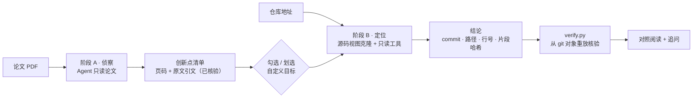
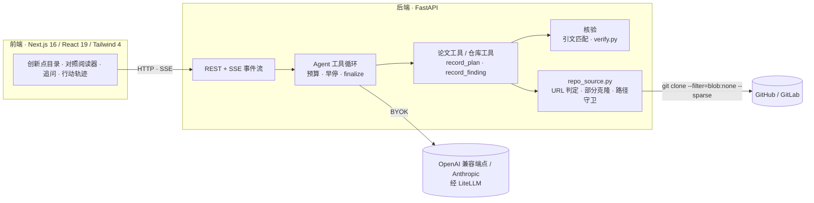

# PaperLens

**论文创新点 ↔ 代码实现的可核验对照系统**

上传一篇论文 PDF，再给一个代码仓库地址。Agent 会自己读论文、翻代码，把论文的核心创新点和仓库里的具体实现逐条对应起来。每条引用都带证据锚点，后端可以机械地复核；实在找不到的，就直接写“未找到”。


<!--
界面截图（建议补上）：把截图放到 docs/images/ 后取消下面这行的注释。

-->

---

## 为什么做这个

读论文配代码时，最费时间的往往是找对应关系：论文第 3 节那个公式，到底落在仓库的哪个文件、哪几行？

通用对话模型能写出“看起来很懂”的解读，但很难判断它有没有编。PaperLens 想把这件事做成**可核验**的：

- 论文侧的每条引文，都要能在指定页找到原文。
- 代码侧的每条引用，都锚定到具体的 commit、文件、行号和片段哈希，后端可以从 git 对象里重放核对。
- 找不到实现时，`not_found` 就是合格的输出，但要附上理由和搜索记录。

它的定位是**帮人快速建立算法与代码之间的对应关系**，新手和熟手都能用。

## 功能特性

- **两阶段 Agent 工作流**
  - 阶段 A「侦察」：只读论文，产出 3–5 条核心创新点，每条带页码、原文引文和代码搜索线索。
  - 阶段 B「定位」：只读代码，逐条定位实现，产出带证据锚点的结论。
  - 两个阶段之间可以人工介入：勾选要深入的条目，或者在原文里划一段加成新目标。
- **引用可机械核验**
  - 论文引文逐条核对是否真出现在那一页，只匹配到开头的会标成“部分匹配”。
  - 代码引用的片段哈希由后端从 `git show <commit>:<path>` 计算，模型无权提供。核验只读 git 对象，不读工作区。
- **双栏对照阅读器**
  - 左栏有两种视图。「PDF 原版」由服务端渲染页面，再叠加引文高亮框，高亮覆盖率如实标注。「原文文本」可以划选文字。
  - 右栏是代码：语法着色，标出引用行。AI 逐段讲解插在对应代码行前，并标注“AI 讲解 · 非仓库原文”。
- **追问对话**
  - 可以针对当前创新点或整篇论文继续提问。Agent 会按需再查论文和代码，每条消息有独立的工具预算。
  - 回答里出现的 `文件:行号` 会被抽出来逐个核对，核对不过的标红。
- **实时行动轨迹**
  - 通过 SSE 推送每次工具调用、结果摘要、耗时、限流等待和预算提醒。
  - 刷新页面后可以从 `events.jsonl` 回放。
- **BYOK（自带 key）**
  - 支持任意 OpenAI 兼容端点（OpenAI、DeepSeek、Moonshot、vLLM、Ollama、one-api 网关等）以及 Anthropic。协议差异只存在于 `providers.py` 一个文件里。
  - 启动自检会先判断这个模型能不能可靠地调用工具。
- **运行治理**
  - 工具调用次数、token 和墙钟时间都有预算。
  - 预算快用完时会提醒模型本身，让它边搜边交。
  - 限流时自动学习节奏并退避，遇到瞬时故障自动重试。
  - 即使失败，也会交付已经核验过的部分。
- **仓库访问硬化**
  - URL 只允许 https，域名走白名单，并做地址判定（兼容 TUN / fake-ip 代理）。
  - 用部分克隆加稀疏检出，只取源码视图。
  - 禁用 hooks、submodule 和 LFS，**绝不执行仓库里的任何代码**。

## 工作原理





几条贯穿始终的设计原则：

1. **后端不做决策。** 后端不分节、不做 AST、不做公式 OCR，也不决定该读什么。它只提供原子工具（读页、读文件、列目录、搜索）和校验（schema、证据核验），读什么、怎么读由 Agent 自己决定。
2. **结构化提交走工具。** `record_plan` 和 `record_finding` 都是工具调用，而不是最后吐出一大段 JSON。这样前端可以增量渲染，写错的地方能被具体指出来并打回重写。
3. **一个 run 一条事件总线。** 侦察、定位、追问共用同一条 SSE 流。`run_end` 永远是最后一条事件，所有要给用户看的结果都在它之前发出。

### 可核验性的边界

| 对象 | 核验方式 | 能证明 | 不能证明 |
|---|---|---|---|
| 论文引文 | 忽略空白差异后，检查引文是否出现在指定页。只匹配到开头的标为“部分匹配” | 这句话确实在那一页 | 这句话支撑得了模型的结论 |
| 代码引用 | 从 `git show <commit>:<path>` 取出行区间，归一化后算 `snippet_sha256`，再重放比对 | 引用指向该 commit 上真实存在的代码行 | 这些行真的实现了那个公式 |
| 追问里的 `文件:行号` | 抽出来后逐个到 git 对象里核对 | 位置真实存在 | 回答本身正确 |

语义上是否正确，靠解释字段、置信度和人工复核来判断。界面上把“引用已核验”和“置信度”分开显示，不混为一谈。

## 快速开始

### 环境要求

- **Python ≥ 3.11**（推荐 3.12）。`litellm` 用到了 3.11 才有的 `typing.NotRequired`，3.10 会直接 ImportError。
- **Node.js ≥ 20** 和 **pnpm**
- **git ≥ 2.25**，部分克隆和稀疏检出需要它。
- 辅助脚本是 bash 写的，开发和验收都在 Linux 上进行。Windows 用户建议用 WSL。

本机没有 3.11+ 的话，可以用 [uv](https://docs.astral.sh/uv/) 装一个，不需要 sudo：

```bash
curl -LsSf https://astral.sh/uv/install.sh | sh
uv python install 3.12
```

### 1. 安装

```bash
git clone https://github.com/Anatkhior/Paper2Code.git
cd Paper2Code

# 后端
cd backend
uv venv --python 3.12 .venv
uv pip install --python .venv/bin/python -r requirements.txt

# 前端
cd ../frontend
pnpm install
```

### 2. 零成本体验（不需要任何 API key）

项目自带一个本地假端点 `devtools/mock_provider.py`，它会扮演一个“听话的模型”，把工具调用、事件流、引文核验和界面都走一遍。另外还附带合成的论文和仓库夹具。

```bash
cd backend

# 首次使用：生成合成论文 PDF 和合成仓库（都被 .gitignore 忽略，需要本地生成）
.venv/bin/python -m tests.paper_fixture
.venv/bin/python -m tests.repo_fixture

# 一键启动三个服务：
#   后端 8000（已打开本地仓库路径开关）、假端点 8123、前端 3000
./scripts/dev_services.sh start
```

然后打开 **http://localhost:3000**。

> 请用 `localhost`，不要用 `127.0.0.1`：Next 开发服务器会拦截来自 `127.0.0.1` 的 HMR 跨源请求，页面看着正常，但点什么都没反应。

按下面的顺序操作：

1. **模型设置**：`base_url` 填 `http://127.0.0.1:8123/v1`，`api_key` 填 `mock-key`，`model` 填 `mock-model`，然后点「运行自检」。
2. **上传论文**：选择 `backend/tests/fixtures/synthetic_paper.pdf`，开始侦察。
3. **勾选创新点**：可以在「原文文本」视图里划一段，把它加成新目标。
4. **代码仓库**：填 `backend/tests/fixtures/sample_repo` 的**绝对路径**，点「开始定位」。
5. **对照阅读**：查看结论，点开引用看原文和代码，也可以继续追问。

其它常用命令：

```bash
./scripts/dev_services.sh status      # 查看服务状态（带健康检查）
./scripts/dev_services.sh logs backend
./scripts/dev_services.sh stop
./scripts/dev_services.sh clean 10    # 清理旧的 run 目录，保留最近 10 个
```

<details>
<summary>也可以手动分别启动三个服务</summary>

```bash
# 终端 1：后端（允许把本地目录当仓库，只用于测试和演示）
cd backend
PAPERLENS_ALLOW_LOCAL_REPO_PATHS=true .venv/bin/python -m uvicorn app.main:app --port 8000

# 终端 2：假端点
cd backend
.venv/bin/python -m uvicorn devtools.mock_provider:app --port 8123

# 终端 3：前端
cd frontend
pnpm dev
```

后端启动后，可以在 http://127.0.0.1:8000/docs 直接调试接口。

</details>

### 3. 使用你自己的模型

在「模型设置」里选一个预设（OpenAI / DeepSeek / Anthropic / 本地 Ollama），或者手动填写下面三项：

```json
{
  "protocol": "openai-compatible",
  "base_url": "https://api.deepseek.com/v1",
  "api_key": "sk-...",
  "model": "deepseek-chat"
}
```

- 本项目**完全依赖可靠的 function calling**。请先跑自检：它会用两轮工具调用判断这个模型能不能用，不行的话会给出人话诊断（例如“该端点没有返回工具调用”）。
- 仓库地址填 `https://github.com/<owner>/<repo>` 即可。默认只允许 github.com 和 gitlab.com，其它托管站见下文「配置」。
- 模型名本身带 `/` 的（例如 OpenRouter 的 `anthropic/claude-…`、SiliconFlow 的 `Qwen/Qwen2.5-72B-Instruct`），按端点要求原样填写即可：填了 `base_url` 的 OpenAI 兼容端点，模型名会被原样发送。只有不填 `base_url` 时，带 `/` 的模型名才会被当作 LiteLLM 的原生路由前缀（例如 `deepseek/deepseek-chat`）。

也可以直接用命令行跑自检：

```bash
curl -s http://127.0.0.1:8000/api/provider/smoke-test \
  -H 'content-type: application/json' \
  -d '{"protocol":"openai-compatible","base_url":"https://api.deepseek.com/v1","api_key":"sk-...","model":"deepseek-chat"}'
```

## 配置

后端配置都通过带 `PAPERLENS_` 前缀的环境变量传入，也可以写进 `backend/.env`。**配置在进程启动时读取，改完要重启后端。** list 类型的变量接受逗号分隔或 JSON 两种写法。

| 变量 | 默认值 | 说明 |
|---|---|---|
| `PAPERLENS_DATA_DIR` | `data` | 运行数据目录，每个 run 一个子目录 |
| `PAPERLENS_MAX_TOOL_CALLS` | `40` | 单个阶段的工具调用上限 |
| `PAPERLENS_MAX_INPUT_TOKENS` | `1500000` | 单个阶段累计输入 token 上限 |
| `PAPERLENS_WALL_CLOCK_SECONDS` | `600` | 单个阶段的墙钟上限 |
| `PAPERLENS_CHAT_MAX_TOOL_CALLS` | `8` | 每条追问的工具调用上限 |
| `PAPERLENS_CHAT_MAX_INPUT_TOKENS` / `PAPERLENS_CHAT_WALL_CLOCK_SECONDS` | `400000` / `180` | 每条追问的 token 和时长上限 |
| `PAPERLENS_PER_TURN_TIMEOUT_SECONDS` | `180` | 单次 LLM 调用超时 |
| `PAPERLENS_LLM_MAX_REQUESTS_PER_MINUTE` | `0` | 客户端主动节流。`0` 表示不节流，撞到 429 后自适应 |
| `PAPERLENS_LLM_MAX_RETRIES` | `5` | 限流或瞬时故障时的最大重试次数 |
| `PAPERLENS_HTTP_USER_AGENT` | `PaperLens/0.1` | LLM 请求的 User-Agent（部分网关会拦截 SDK 默认 UA） |
| `PAPERLENS_MAX_UPLOAD_MB` / `PAPERLENS_MAX_PAGES` | `50` / `50` | 论文大小和页数上限 |
| `PAPERLENS_REPO_ALLOWED_HOSTS` | `github.com,gitlab.com` | 仓库域名白名单，条目可以写成 `host:port` |
| `PAPERLENS_REPO_CLONE_TIMEOUT_SECONDS` | `300` | 克隆超时 |
| `PAPERLENS_REPO_MAX_MB` | `200` | 克隆后的磁盘占用上限 |
| `PAPERLENS_REPO_SPARSE` / `PAPERLENS_REPO_SPARSE_EXCLUDE` | `true` / 空 | 源码视图克隆开关，以及追加的排除规则（例如 `!data,!/docs/assets`） |
| `PAPERLENS_REPO_NETWORK_MODE` | `local` | `local` 适合单机自用，只拒绝回环、链路本地等地址。`hosted` 适合公网部署，判定更严格 |
| `PAPERLENS_REPO_ALLOW_CIDRS` | 空 | 显式信任的网段，例如企业内网镜像 `10.20.0.0/16` |
| `PAPERLENS_REPO_DNS_CROSSCHECK` | `auto` | 是否用公网 DoH 交叉核验非公网解析结果。`auto` 表示只在 `hosted` 模式下核验 |
| `PAPERLENS_ALLOW_LOCAL_REPO_PATHS` | `false` | 允许克隆本地目录。**只用于测试和演示，公网部署绝不能打开** |
| `PAPERLENS_CORS_ORIGINS` | `["http://localhost:3000","http://127.0.0.1:3000"]` | 前端来源白名单（请用 JSON 写法） |

前端只有一个配置项：`NEXT_PUBLIC_API_BASE`，默认是 `http://127.0.0.1:8000`。把 `frontend/.env.local.example` 复制成 `.env.local` 再修改。注意它在构建时就被写进产物，改完要重新构建。

## API 概览

完整的交互式文档见后端的 `/docs`（FastAPI 自动生成）。

| 方法 | 路径 | 说明 |
|---|---|---|
| GET | `/api/health` | 健康检查、预算上限、当前生效的限流节奏 |
| POST | `/api/provider/smoke-test` | 模型自检，判断能否可靠地调用工具 |
| POST | `/api/runs` | multipart 上传 PDF 和 provider 配置，返回 `run_id` |
| POST | `/api/runs/{id}/recon` | 启动阶段 A（侦察） |
| GET | `/api/runs/{id}/plan` | 获取创新点清单（服务端为准，含用户添加的目标） |
| POST / PATCH / DELETE | `/api/runs/{id}/plan/items[/{item_id}]` | 新增、修改、删除定位目标 |
| POST | `/api/runs/{id}/locate` | 启动阶段 B（定位与核验） |
| GET / POST | `/api/runs/{id}/chat` | 获取对话记录 / 发一条追问 |
| GET | `/api/runs/{id}/events` | 统一的 SSE 事件流，支持 `Last-Event-ID` / `?from_id=` 续传 |
| GET | `/api/runs/{id}` | 事件历史和产物，用于刷新后回放 |
| GET | `/api/runs/{id}/file` | 读取锁定 commit 上的一段代码（从 git 对象读） |
| GET | `/api/runs/{id}/pdf` | 原样返回上传的 PDF |
| GET | `/api/runs/{id}/paper/page/{n}` | 某一页的原文。带 `?quote=` 时同时返回高亮矩形和覆盖率 |
| GET | `/api/runs/{id}/paper/page/{n}/image` | 该页的渲染图（PNG） |
| POST | `/api/runs/{id}/cancel` | 取消当前阶段 |
| POST | `/api/analyze` | 最小链路自检（不需要论文） |

SSE 事件类型：`paper_ready`、`run_start`、`step_start`、`assistant_text`、`tool_call`、`tool_result`、`plan_ready`、`plan_updated`、`repo_cloning`、`clone_progress`、`repo_ready`、`finding`、`verification_done`、`chat_user`、`chat_reply`、`budget_warning`、`llm_retry`、`error`、`run_end`（总是最后一条）。

## 评估

一份“看起来很懂”的解读很容易写，难的是知道它到底有多准。评估指标都是**从产物里数出来的**，不引入第二个模型打分。

| 指标 | 含义 |
|---|---|
| `plan_recall` / `plan_precision` | 人工标注的创新点与系统清单对得上多少 |
| `file_recall` / `file_precision` | 该找到的文件找到了多少，引用有多少落在正确范围内 |
| `symbol_recall` | 标注要求的函数或类是否出现在引用中 |
| **`citation_verifiable_rate`** | 通过机械核验的引用占全部引用的比例 |
| `honest_not_found_rate` | 仓库里确实没有实现时，系统有没有诚实地报“未找到” |

指标本身也要能被证伪。验收脚本会把手工构造的“答错产物”喂给指标函数，断言分数确实会下降。只会输出 100% 的指标，等于没有指标。

**当前状态（如实说明）：**

| 场景 | plan recall | file recall | 引用可核验率 | 诚实报未找到 |
|---|---|---|---|---|
| 离线基线（脚本化假端点 + 合成夹具） | 100% | 100% | 100%（2/2） | 100% |
| 真实模型 + 真实论文 | 待补充 | 待补充 | 待补充 | 待补充 |

> ⚠️ 离线基线只能证明评估链路和指标定义本身没写错，**不代表真实模型的能力**。真实论文的 gold set 还在建设中，欢迎贡献。

运行方式：

```bash
cd backend
.venv/bin/python -m eval.run_eval                       # 离线基线（零成本）

PAPERLENS_EVAL_BASE_URL=https://api.deepseek.com/v1 \
PAPERLENS_EVAL_API_KEY=sk-... \
PAPERLENS_EVAL_MODEL=deepseek-chat \
.venv/bin/python -m eval.run_eval --provider real --label "DeepSeek-V3"
```

标注纪律写在 `backend/eval/goldset.yaml` 的文件头里，比数字本身更重要：

1. **先标注、后运行**：人工读完论文和代码、写下答案并冻结 commit，之后才允许跑系统。
2. **commit 必须冻结**：仓库一直在变，不钉死版本的指标没有意义。
3. **gold set 只看一次**：想边跑边调提示词，请另开调参集。

## 测试与验收

每个里程碑都有一份可执行的离线验收脚本。脚本通过本地假端点驱动完整链路，共 500+ 项断言：

```bash
cd backend
./scripts/run_all_checks.sh      # 一键全跑，任何一项失败都以非零码退出
```

| 脚本 | 覆盖内容 |
|---|---|
| `m0_check` | BYOK 抽象、自检的各类诊断、SSE 事件契约、预算记账、回放与续传 |
| `m1_check` | 阶段 A 全链路、引文核验与打回、限流退避、限额识别、瞬时故障重试 |
| `m2_check` | 阶段 B：URL 与地址判定矩阵、源码视图克隆、核验的各种失败形态、部分勾选、原地打转早停、预算提醒 |
| `m3_check` | 阅读端点、路径穿越、PDF 高亮矩形、前端生产构建与页面渲染 |
| `m4_check` | 评估指标可证伪、gold set 卫生、README 数字一致性 |
| `m6_check` | 划选添加定位目标、清单增删改与并发守卫 |
| `m7_check` | 追问：事件链、历史传递、每条消息的工具上限、回答里的引用核对 |

注意事项：

- 验收使用专属端口 **8231/8232**，不会和手动调试的 8000/8123 冲突。
- `m3`、`m6` 会执行 `pnpm build`，跑之前先停掉 `next dev`。
- 前端构建会通过 `next/font` 拉取 Google Fonts，`m2` 里还有一项会访问 github.com。所以需要能联网。
- 前端的纯逻辑测试：`cd frontend && node --test lib/*.test.mjs`

## 安全与隐私

- **密钥**：`api_key` 只放在请求体里，后端不落盘、不写日志、不进错误堆栈（`repr=False`，日志只输出“协议 · 主机 · 模型”）。前端默认不保存 key，要保存必须显式勾选，而且只存在当前浏览器的 localStorage 里。
- **不可信数据**：论文、代码、README、注释都当作待分析的材料，其中出现的“指令”一律不执行。更重要的是结构性防线：引用必须通过机械核验，注入者最多能影响解释文字，骗不过引用。
- **仓库访问**：
  - URL 只允许 https，域名走白名单，拒绝带 userinfo 的地址。
  - 地址判定按部署模式分严格度。挂 TUN / fake-ip 代理时，本机 DNS 给出的只是占位地址，不会被当成内网误杀。
  - 克隆使用 `--depth 1 --filter=blob:none --sparse`，禁用 hooks、submodule 和 LFS。
  - 克隆时关闭符号链接（`core.symlinks=false`），读文件、列目录、搜索都不跟随链接，仓库里的链接没法把读取引到仓库外面。
  - 有体积上限、超时和路径穿越防护，并且**绝不执行仓库里的任何代码**。
- **部署边界**：项目按单机自用设计，没有账号体系和鉴权。如果要部署到公网，除了设置 `PAPERLENS_REPO_NETWORK_MODE=hosted`，还需要自行补上鉴权和配额，并做网络层隔离（容器、netns、防火墙）。进程内的 DNS 检查不是安全边界。

## 项目结构

```
backend/
  app/
    main.py              FastAPI 全部端点（上传 / 侦察 / 定位 / 清单 / 追问 / 阅读 / SSE）
    providers.py         BYOK 唯一抽象层：LiteLLM 调用、自检、限流学习、错误诊断
    agent/loop.py        Agent 工具循环：流式、预算、原地打转早停、finalize 钩子
    agent/tools/         论文工具、仓库工具、record_plan / record_finding
    paper.py             PDF 读取、引文核验、高亮定位（几何序列匹配）
    repo_source.py       仓库访问层：URL 判定、源码视图克隆、路径守卫、搜索
    verify.py            确定性重放核验（citation_verifiable_rate 的来源）
    plan.py / chat.py    可编辑的创新点清单 / 追问对话与回答中的引用核对
    events.py / store.py 事件总线与 SSE / 运行数据落盘
    eval_metrics.py      评估指标（纯函数）
    prompts.py / config.py 提示词（含不可信数据声明）/ 配置
  devtools/mock_provider.py  本地假端点：多种行为变体（限流、断流、HTML 错误页、坏参数…）
  scripts/               里程碑验收脚本、run_all_checks.sh、dev_services.sh
  tests/                 合成论文与合成仓库夹具、几何与阅读接口的单元测试
  eval/                  goldset.yaml、run_eval.py、评估报告
frontend/
  app/page.tsx           单页主状态：准备区、创新点目录、当前条目、阅读器、追问
  components/            Reader、PlanList、ComparePanel、ChatPanel、Timeline、CoverageCard、Markdown…
  lib/                   API 封装、事件类型、阅读器请求管理、Prism 语法着色、讲解定位
docs/v0-spec.md          规格：决策、范围、schema、安全、评估、里程碑
```

每个 run 的数据都放在 `backend/data/<run_id>/` 下：`paper.pdf`、`meta.json`、`events.jsonl`（SSE 的事实来源）、`plan.json`、`artifact.json`、`chat.jsonl`，以及锁定到某个 commit 的 `repo/`。

## 已知限制

- **真实模型的评估数字尚未产出**，gold set 目前只有 1 对合成夹具。
- 不支持扫描版 PDF（没有 OCR）。论文上限是 50 页、50MB。
- 公式、架构图不做视觉理解。PDF 视图只负责原样展示和高亮。
- 代码搜索是纯 Python 实现的正则搜索，结果顺序确定，但大仓库会比较慢，并受文件数和时间预算约束。触到上限时，搜索结果会如实标为“未扫完”，Agent 不会据此判定“不存在”。
- 不支持私有仓库和需要鉴权的仓库。
- 只适合单机自用，没有账号体系、鉴权和多租户隔离。

## 路线图

- [ ] 用真实论文和真实模型跑出第一组评估数字，扩充 gold set
- [ ] 各条创新点并行定位
- [ ] 把公式和架构图页面的图像交给多模态模型
- [ ] 多 provider 兼容性矩阵
- [ ] 可选的符号骨架工具（tree-sitter）

## 常见问题

<details>
<summary>填了正常的 GitHub 地址，却报“解析到了内网/保留地址”</summary>

多半是开着 Clash、Mihomo、sing-box 这类 TUN + fake-ip 代理：本机 DNS 把域名答成了 `198.18.x.x` 这样的占位地址。默认的 `local` 模式已经放行这种情况，只会在时间线上提示一句。如果设置了 `hosted` 模式，可以用 `PAPERLENS_REPO_ALLOW_CIDRS=198.18.0.0/15` 显式信任这个网段。公司内网的 GitLab 或镜像，需要把域名加进 `PAPERLENS_REPO_ALLOWED_HOSTS`。
</details>

<details>
<summary>运行中报 RateLimitError / 429</summary>

通常不用配置。系统会优先读取响应头里声明的限额，其次识别网关的话术（中英文都认），自动降速，并在时间线上显示“等待 N 秒后重试”。如果是额度用尽或欠费，系统不会重试，会直接告诉你重试没用。想手动固定节奏，可以设置 `PAPERLENS_LLM_MAX_REQUESTS_PER_MINUTE`。已经定位并核验过的结论不会因为失败而丢失。
</details>

<details>
<summary>自检返回一整页 HTML 或 403</summary>

有些套了 Cloudflare 的第三方网关会按 User-Agent 拦截 Python SDK 的请求。PaperLens 默认带自定义 UA `PaperLens/0.1`。如果仍然被拦，可以把 `PAPERLENS_HTTP_USER_AGENT` 设成任意一个浏览器 UA，然后重启后端。
</details>

<details>
<summary>仓库里有很大的视频或数据集，克隆很慢或超出上限</summary>

默认只取源码视图（部分克隆 + 稀疏检出）。实测一个含 83MB 演示视频的仓库，从 237MB 降到了 2.3MB。冷门的大二进制格式会在时间线上被点名，按提示加一条 `PAPERLENS_REPO_SPARSE_EXCLUDE=!*.xxx` 即可。
</details>

<details>
<summary>工具调用次数用完了，却一条结论都没有</summary>

提示词要求模型“边搜边交”，循环会在预算用到 60% 和 85% 时，把预算提醒直接注入给模型。如果确实需要更多预算，可以调大 `PAPERLENS_MAX_TOOL_CALLS`，并同时调大 `PAPERLENS_WALL_CLOCK_SECONDS`。
</details>

<details>
<summary>页面能打开，但点击没有任何反应</summary>

开发模式下请用 `http://localhost:3000` 访问，而不是 `127.0.0.1:3000`。另外要确认后端地址和 `NEXT_PUBLIC_API_BASE` 一致。
</details>

## 参与贡献

欢迎提 Issue 和 PR。提交之前请：

1. 为行为改动补上验收断言，并确保 `backend/scripts/run_all_checks.sh` 全部通过。
2. 修改前端后跑一次 `pnpm build`，做完整的 TypeScript 检查。
3. 遵守项目的几条底线：
   - 不写死服务商或模型，协议差异只放在 `providers.py`。
   - 任何“论文说了 X / 代码在 Y”的结论都必须能被机械核验。
   - 不在代码、日志或提交里出现任何密钥。

## 致谢

本项目基于这些优秀的开源项目构建：[FastAPI](https://fastapi.tiangolo.com/)、[LiteLLM](https://github.com/BerriAI/litellm)、[PyMuPDF](https://pymupdf.readthedocs.io/)、[sse-starlette](https://github.com/sysid/sse-starlette)、[Next.js](https://nextjs.org/)、[Tailwind CSS](https://tailwindcss.com/)、[Prism](https://prismjs.com/)。

## 许可证

本项目采用 [Apache License 2.0](LICENSE) 许可。
